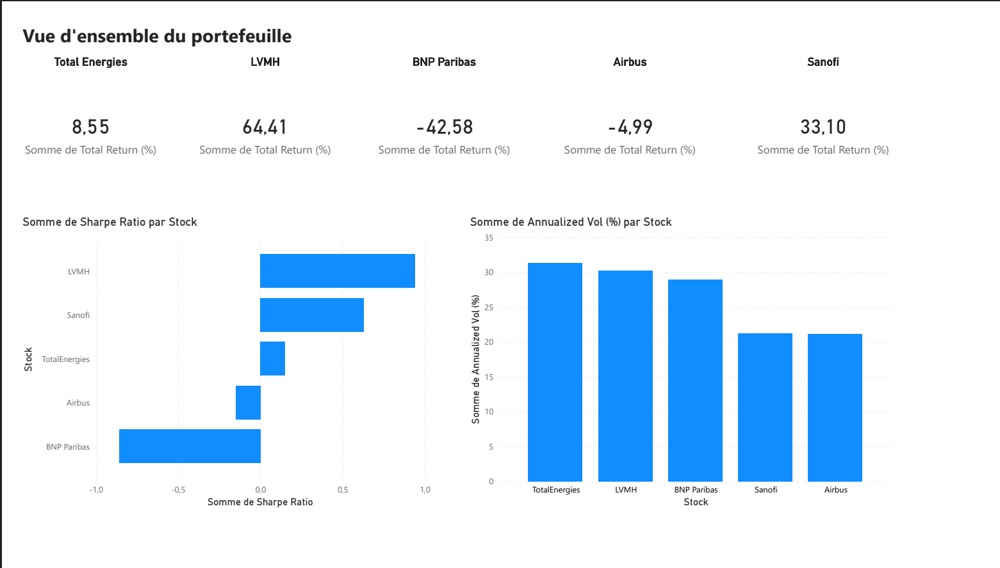
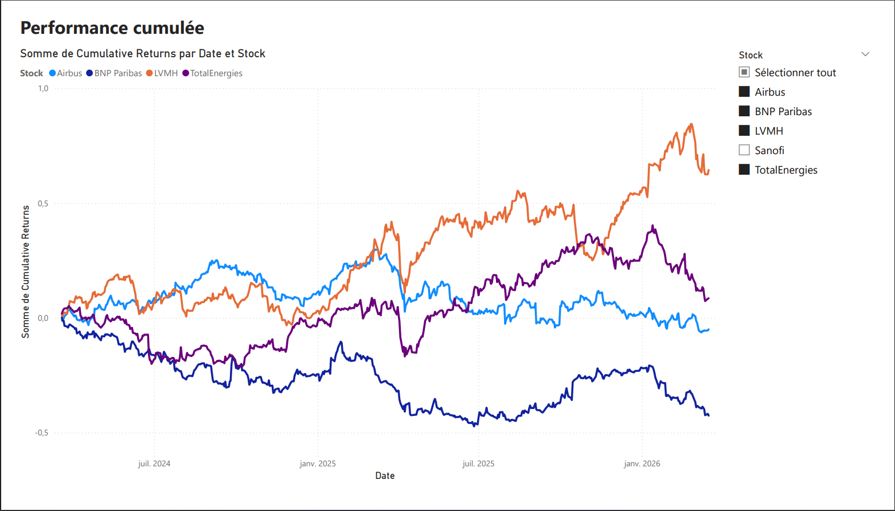
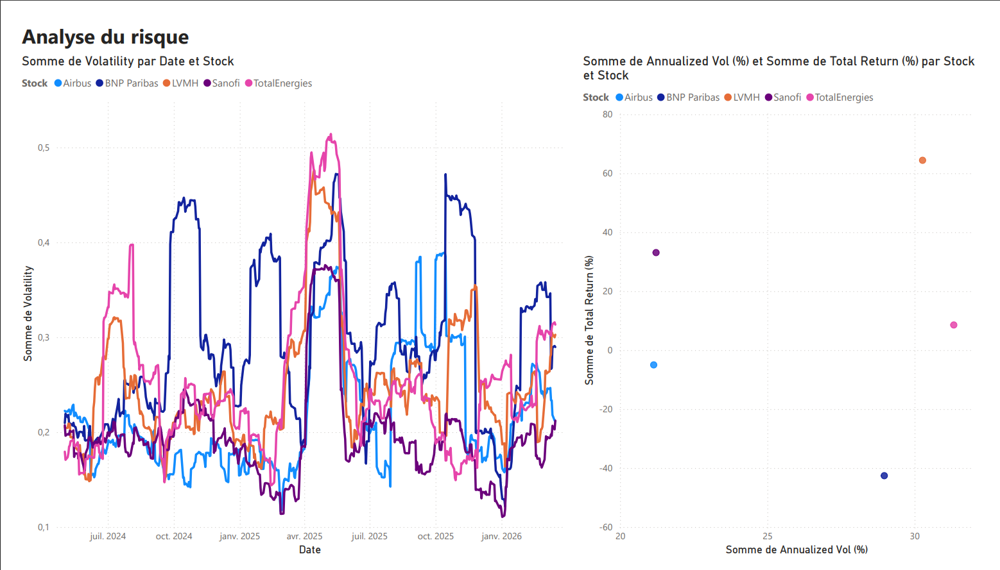
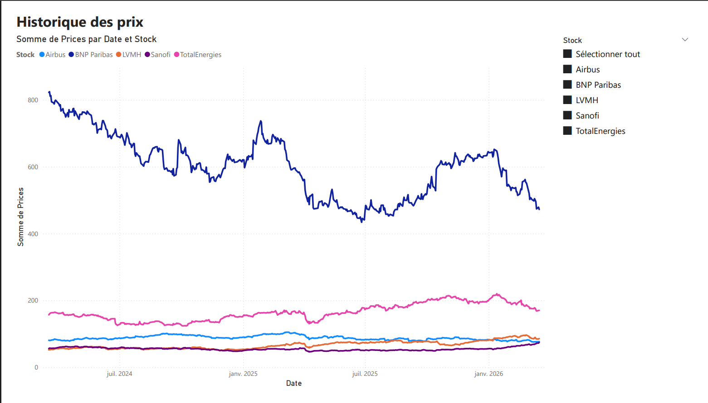

# 📊 Dashboard Portefeuille CAC 40 — Power BI

## Description
Dashboard interactif de suivi d'un portefeuille de 5 actions du CAC 40 
(LVMH, BNP Paribas, TotalEnergies, Airbus, Sanofi) sur 2 ans (2024–2026).

## Stack technique
- Python (pandas, yfinance) — collecte et traitement des données
- Power BI — dashboard interactif 4 pages

## Indicateurs analysés
- Rendement cumulé par action
- Volatilité annualisée (21–31%)
- Ratio de Sharpe
- Analyse Risque / Rendement

## Pages du dashboard
| Page | Contenu |
|---|---|
| Vue d'ensemble | KPI cards, Sharpe Ratio, Volatilité |
| Performance | Rendements cumulés sur 2 ans |
| Risque | Volatilité glissante, scatter Risque/Rendement |
| Prix | Historique des cours en € |

## Aperçu

